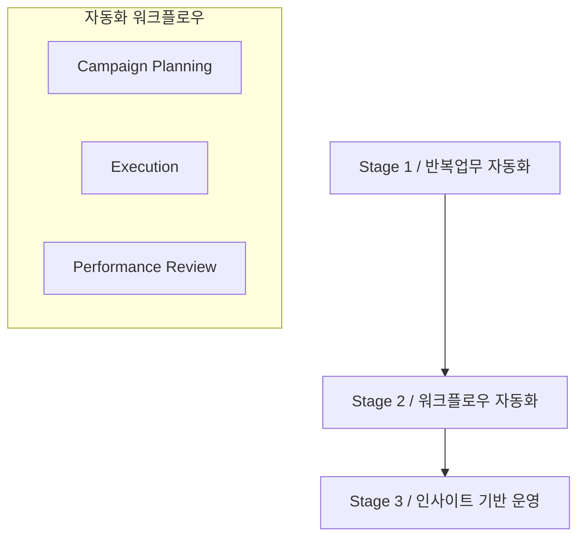

# Rule: Mermaid 렌더링 방어 규칙
**Precedence: 1**

## 1. 목적
PPT/HTML/Markdown 변환 과정에서 Mermaid 차트가 Obsidian에서 깨지는 문제를 방지합니다. Mermaid는 Markdown보다 파서가 민감하므로, 생성 단계와 최종 리뷰 단계에서 아래 규칙을 반드시 적용합니다.

## 2. 생성 원칙
1. Mermaid는 명확한 방향성 흐름이 있는 간단한 프로세스에만 사용합니다.
2. 로드맵, WBS, 표, 매트릭스, KPI 비교, 복잡한 슬라이드 레이아웃은 Mermaid보다 Markdown Table 또는 중첩 리스트를 우선합니다.
3. Callout 안에 Mermaid fence를 넣지 않습니다. 설명 callout과 Mermaid 블록은 분리합니다.
4. Mermaid 블록은 반드시 문단 최상위에서 시작합니다.

## 3. 금지 문법
아래 문법은 Obsidian Mermaid 렌더링 실패로 간주합니다.

```text
> ```mermaid
> graph TD
```

```text
A[Stage 1 (2026)] --> B[Stage 2 / Next]
```

```text
A["Stage 1] --> B["Stage 2"]
```

```text
subgraph Workflow["자동화 워크플로우]
```

```text
A["1단계<br>반복업무 자동화"]
```

## 4. 허용 문법
노드 라벨과 subgraph 라벨은 항상 닫힌 쌍따옴표로 감쌉니다.



## 5. 정제 규칙
Mermaid 블록을 발견하면 아래 순서로 자동 정제합니다.

1. `> ```mermaid`는 ` ```mermaid`로 바꾸고 blockquote 밖으로 분리합니다.
2. Mermaid 블록 내부의 `> ` 접두어를 제거합니다.
3. `A[라벨]` 형태는 `A["라벨"]`로 바꿉니다.
4. `A["라벨]` 형태는 `A["라벨"]`로 닫는 따옴표를 보정합니다.
5. `subgraph ID["라벨]` 형태는 `subgraph ID["라벨"]`로 보정합니다.
6. 라벨 내부의 `<br>`, `<br/>`, `<b>`, `</b>` 등 HTML 태그는 제거하거나 ` / `로 치환합니다.
7. 시작 fence와 종료 fence가 정확히 1쌍인지 확인합니다.

## 6. QC 완료 조건
최종 문서에서 Mermaid 블록은 아래 검사를 모두 통과해야 합니다.

- 모든 Mermaid 블록이 `^```mermaid`로 시작하고 `^```$`로 닫힘
- Mermaid 블록 내부에 `>`로 시작하는 줄이 없음
- Mermaid 블록 내부에 HTML 태그가 없음
- Mermaid 블록 내부 각 줄의 쌍따옴표 개수가 짝수
- `["..."]` 라벨과 `subgraph ID["..."]` 라벨이 모두 닫힘
- 실패 항목이 하나라도 있으면 최종 완료를 선언하지 않고 Markdown Table, 중첩 리스트, 또는 안전한 Mermaid로 재작성
